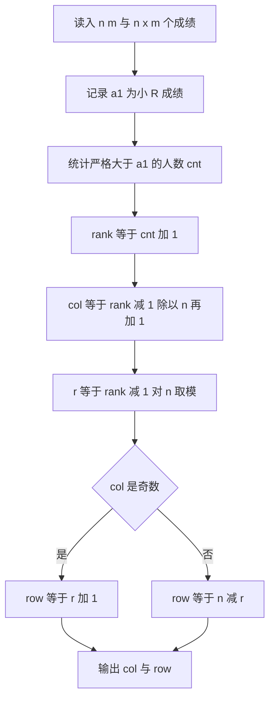

# P14358（CSP-J 2025 第二轮 · 座位分配）解题方案

## 一、题意梳理

- 考场共 `n * m` 名考生，成绩互不相同，按成绩由高到低编号 `s1 > s2 > ... > s(n*m)`。
- 座位为 `n` 行 `m` 列，按**列优先蛇形**分配：
  - 第 1 列：从上到下（第 1 行 → 第 n 行）填 `s1..sn`；
  - 第 2 列：从下到上（第 n 行 → 第 1 行）填 `s(n+1)..s(2n)`；
  - 第 3 列：从上到下……依次交替。
- 输入 `n, m` 及 `n*m` 个成绩，其中 `a1` 为小 R 的成绩。
- 输出小 R 的座位 **列号 行号**（先列后行）。

## 二、核心映射公式

设小 R 的名次（从 1 开始，分数越高名次越小）：

```
rank = 1 + (分数严格大于 a1 的考生人数)
col  = (rank - 1) / n + 1            // 所在列，1..m
r    = (rank - 1) % n                // 该列内的 0 基序号，0..n-1
row  = (col 为奇数) ? r + 1 : n - r  // 奇数列向下、偶数列向上
输出： col row
```

验证示例 `n=4, m=5`：

| rank | col | r | 奇偶 | row |
| --- | --- | --- | --- | --- |
| 1 | 1 | 0 | 奇 | 1 |
| 4 | 1 | 3 | 奇 | 4 |
| 5 | 2 | 0 | 偶 | 4 |
| 8 | 2 | 3 | 偶 | 1 |
| 9 | 3 | 0 | 奇 | 1 |

与题意箭头顺序一致。

## 三、现有代码缺陷分析（P14358.cpp）

1. **数组越界**：`int stu[102]`，而 `n*m` 由数据范围决定（CSP-J 数据通常可达 `10^6` 量级），必然越界。应改为 `vector<int>` 或按上限开数组。
2. **排名查找逻辑错误**：代码先令 `ming = a1`，排序后执行
   `if (stu[i] == ming) ming = i;`
   第一次命中后 `ming` 变成**下标**，后续循环会用「某个考生的分数」去和这个下标比较；若存在某考生分数恰好等于该下标值，`ming` 会被二次覆盖，得到错误名次。
   例：`n*m=5`，成绩 `100 50 40 30 1`，`a1=100`（rank=1）；命中后 `ming=1`，循环到 `stu[5]=1` 时又满足 `1 == ming`，`ming` 被改成 `5`，答案错误。
3. **可读性**：变量名 `ming` 实为「名次 rank」，易误导；`cmp`/`ansx`/`ansy` 命名亦不直观。
4. **健壮性**：`sort` 全量排序并非必需，直接统计「大于 a1 的个数」即可，`O(n*m)` 且无排序开销。

## 四、推荐实现要点

- 用 `vector<int> a(n * m)`（或全局数组按 `n*m` 上限开）读入全部成绩，保存 `a1 = a[0]`。
- `rank = 1; for (x : a) if (x > a1) ++rank;`（更简洁、无越界风险）。
  等价写法：对降序数组用 `lower_bound(begin, end, a1, greater<int>())` 取下标 +1。
- 按第二节公式计算 `col, row`，输出 `col << ' ' << row`。
- 数据类型：`rank`、`col`、`r` 使用 `long long` 或 `int`（`n*m ≤ 10^6` 时 `int` 足够，但用 `long long` 更稳妥）。

## 五、流程示意



## 六、验证用例设计

- 样例：使用洛谷题面给出的 `n=4, m=5` 图示数据核对蛇形顺序。
- `n*m = 1`：唯一考生，输出 `1 1`。
- `a1` 为最高分（rank=1）：输出 `1 1`。
- `a1` 为最低分（rank=n*m）：列号 `m`，行号按 `m` 的奇偶为 `n` 或 `1`。
- 偶数列边界：`rank` 落在偶数列首元素时应输出 `row = n`。
- 覆盖「分数恰好等于名次」的构造数据，专门回归第二节所述旧 bug。
