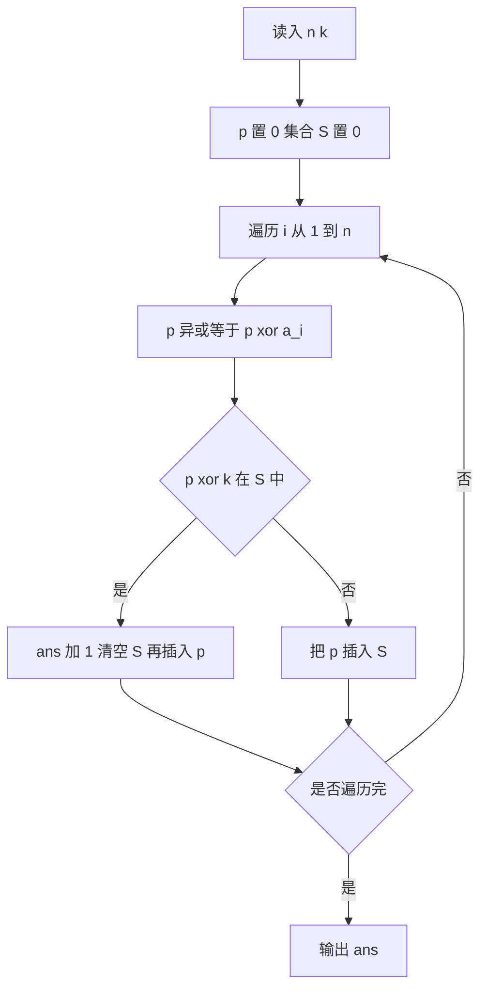

# P14359 解题方案

## 一、题意

- 给定长度 `n` 的非负整数序列 `a[1..n]` 与非负整数 `k`。
- 区间 `[l, r]` 的权值为 `a[l] xor a[l+1] xor ... xor a[r]`。
- 求最多能选出多少个**互不相交**的区间，使每个区间权值都等于 `k`。

## 二、转化

设前缀异或 `p[0] = 0`，`p[i] = a[1] xor ... xor a[i]`，则

```
xor(a[l..r]) = p[r] xor p[l-1]
```

于是「区间权值为 k」等价于 `p[r] xor p[l-1] = k`，即 `p[l-1] = p[r] xor k`。

问题转化为：在 `p` 序列（下标 `0..n`）中，尽量多地选出成对的 `(l-1, r)`，
满足 `l-1 < r`、`p[l-1] = p[r] xor k`，且各对之间不共享下标、不同对不能交叉使用元素
（对应原问题区间互不相交：即 `r1 < l2 - 1`）。

## 三、贪心模型

「区间互不相交且数量最大」是经典的**区间调度**问题：按**右端点最早结束**贪心最优。

- 从当前位置 `s` 出发，在 `[s, n]` 中找**右端点最小**的合法区间 `[l, r]`（存在 `l-1 in [s-1, r-1]` 使 `p[l-1] = p[r] xor k`）。
- 取该区间后，令 `s = r + 1`，继续。

**关键点**：不能限定 `l = s`（现有代码的错误所在）。合法的 `l` 可以大于 `s`，
只要 `l-1` 落在 `[s-1, r-1]` 内即可。

## 四、O(n) 实现（哈希集合维护段内前缀异或）

维护集合 `S`，表示当前段中已出现的 `p[t]`（`t in [s-1, r-1]`）。
初始 `S = {p[0]} = {0}`，`s = 1`。

```
ans = 0; p = 0; S = {0};
for i = 1..n:
    p ^= a[i];                 // p 即 p[i]
    if S.count(p ^ k):         // 存在 l-1 使 p[l-1] = p[i] xor k → 找到结束于 i 的合法区间
        ans++;
        S.clear();             // 新区间从 i+1 开始，段起点 s-1 = i
        S.insert(p);           // S 重新变为 {p[i]}
    else:
        S.insert(p);
输出 ans
```

复杂度：期望 `O(n)`（`unordered_set`），空间 `O(n)`。

## 五、现有代码问题（P14359.cpp）

1. **复杂度**：双重循环在无解或匹配稀疏时为 `O(n^2)`（`n` 可达 `5*10^5`），必然 TLE。
2. **贪心错误**：内层 `for (j = i ...)` 限定了区间左端点 `l = i`，忽略了 `l > i` 的更优选择。
   - 反例：`n=4, k=2, a=[1,2,1,3]`，正确答案 `2`（取 `[2,2]`、`[3,4]`），现有代码输出 `1`（取了 `[1,3]` 后跳走）。
3. **数据类型**：异或值使用 `int` 在 `a[i] <= 1e9` 时可行，但为稳妥可用 `long long` 与 `unordered_set<long long>`。

## 六、流程示意



## 七、验证用例

- 题面样例一：`a=[2,1,0,3], k=2`，答案 `2`。
- 题面样例二：`a=[2,1,0,3], k=3`，答案 `2`。
- 反例回归：`a=[1,2,1,3], k=2`，答案 `2`（现有代码会输出 `1`）。
- 边界：`n=1`；`k=0`（如 `a=[0,0]` 答案为 `1`，`a=[5,5]` 答案为 `1`）；全序列无解时为 `0`。
- 大规模随机对拍：与 `O(n^2)` 暴力在小数据上随机对拍，确保贪心正确。
